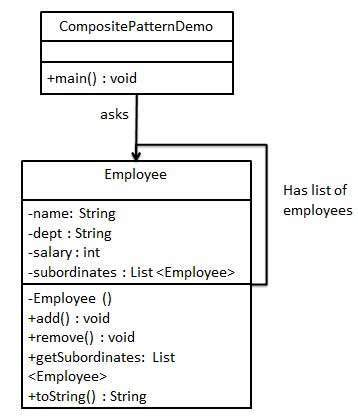
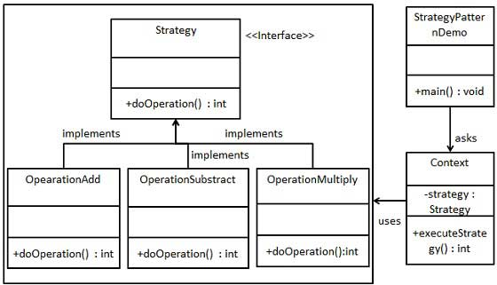

# Java Design Patterns

## Creational Patterns

### Factory Pattern 

Use a factory class to create normal classes through specifying class type as input parameter rather than use new operator. 

### Abstract Factory Pattern

Use a super-factory (factory producer) to create other factories through specifying factory type as input parameter rather than use new operator.

相当于再提一层。

### Singleton Pattern

Use a single class which is responsible to create an object which can be accessed directly without instantiating the object of the class.

### Builder Pattern

Create a complex object (it is Meal here) which contains simple objects (it is Item here), e.g. a field of the complex object is a collection of other simple objects. 

### Prototype Pattern

Create a duplicate or **clone** of current object while keeping performance in mind.

We can cache the object, returns its clone on next request and update the database as and when needed thus reducing database calls.

When to use:

- Creation of object directly is costly, e.g. costly database operation.

## Structural Patterns

### Adapter Pattern

Use a sinlge class to combine the capabilities or functionalities of two independent or incompatible interfaces.

A real life example could be a case of card reader which acts as an adapter between a memory card and a laptop. You plugin the memory card into card reader and card reader into the laptop so that memory card can be read via laptop.

### Bridge Pattern

Use an interface which acts as a bridge to **decouple** an abstraction from its implementation so that the two can be altered independently without affecting each other.

Composition over inheritance.

Collections framework in Java has examples of the bridge interface: ArrayList and LinkedList are implement List. And List provides common methods to add, remove or check size. 

### Filter Pattern

It filters a set of objects using different criteria / filters and chaining them in a decoupled way through logical operations. 

It combines multiple criteria / filters to obtain single criterion / filter.

For exapmle, we have original `CriterionMale`, `CriteriaFemale` and `CriteriaSingle` to filter people seperately. Now we add `AndCriteria` and `OrCriteria` to chain two of those three criteria together so as to get more complex criteria. 

### Composite Pattern

Create a class that contains group of its own objects and make this group as an attribute of this class. And this class provides methods to modify this attribute.

### Decorator Pattern

Create a decorator class which wraps an existing class (contains its object as an attribute) in order to provide additional functionality without altering structure of the original class.

### Facade Pattern 

Create a (facade) class as an interface to the existing system, which can be used by clients to access the system hiding its complexities.

Then the client do not need to create instances for each classes in the system. Instead, you make objects of those classes as attributes of the facade class and provide methods wrapping methods of those classes. Thereby, the client is able to only create an instance for the facade class to call methods of those classes in the system. 

When creating the instance of the facade class using the constructor, the client does not need to pass objects as input parameters. 

### Proxy Pattern

Create a proxy class to represent functionality of another (real) class in order to restrict its access from outside of the system. 

The proxy class make the object of the real class as an attribute. 

The method to be restricted in the real class is **private** rather than public. And this method is invoked in this constructor, so that it will be invoked only once when the instance of the real class is created. 

## Behavioral Patterns

### Command Pattern

The command class which implements the command interface, makes the object as its attribute with execute method invoking specific methods of the object. The command executor class makes a list of command objects as its attribute with execute method invoking the execute method of the command class for each command object. After executing, the list of command objects should be cleared.  

### Observer Pattern 

There is a Subject class that is observed, and some Observer classes that observe the Subject class. The Subject class has a list of Observer objects as an attribute. 

If there is any change to the state attribute of Subject class, it will notify all Observer classes through `notifyAllObservers()` method, and these Observer classes will get updated accordingly through `update()` method . 

The Subject class is able to attach new Observer classes into the list and detach old Observer classes from the list. This is realized by Observer class having the object of Subject class as an attribute, making it as the input parameter of its constructor and having it to attach the Observer instance in the constructor. Thus, when a new Observer instance is created, this instance itself will be attached to the list of Observer class objects through `this.subject.attachObserver(this)` method. 

### Strategy Pattern 

Create a Context class making the object of Strategy class as its attribute and input parameter of constructor. 

When creating instances for this Context class using constructor, pass different types of instances of Strategy class as input parameter to realize different strategies. 

 

## J2EE Patterns

### MVC Pattern 

- Model 

- View 
- Controller - having object of Model class and View class as attributes. 
  - Method names in Controller should be more meaningful and readable compared with those in Model class. 

