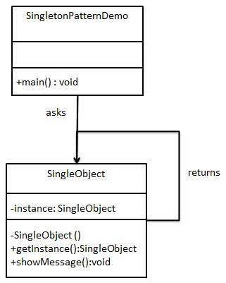

# Java Design Patterns

- [Java Design Patterns](#java-design-patterns)
  - [Code Maintainability and Anti-Patterns](#code-maintainability-and-anti-patterns)
    - [Code Maintainability](#code-maintainability)
    - [Anti-Patterns](#anti-patterns)
    - [KISS Principle](#kiss-principle)
    - [DRY Principle](#dry-principle)
    - [Principle of Least Surprise](#principle-of-least-surprise)
    - [Cohesion](#cohesion)
      - [Class-Level Cohesion](#class-level-cohesion)
      - [Method-Level Cohesion](#method-level-cohesion)
    - [Coupling](#coupling)
  - [Exception Handling](#exception-handling)
    - [Anti-Patterns with Exceptions](#anti-patterns-with-exceptions)
      - [Overly Specific](#overly-specific)
      - [Overly Apathetic](#overly-apathetic)
    - [Notification Pattern](#notification-pattern)
    - [Guidelines for Using Exceptions](#guidelines-for-using-exceptions)
    - [Alternatives to Exceptions](#alternatives-to-exceptions)
      - [Null Object Pattern](#null-object-pattern)
      - [`Optional<T>`](#optionalt)
  - [Tips](#tips)
    - [Domain Class or Primitive Value](#domain-class-or-primitive-value)
    - [Principle of Strong Typing](#principle-of-strong-typing)
    - [Discoverability](#discoverability)
    - [Scoping and Encapsulation Choices](#scoping-and-encapsulation-choices)
    - [Interfaces VS Classes](#interfaces-vs-classes)
    - [Inheritance](#inheritance)
    - [Reusing Code](#reusing-code)
  - [Design Principles](#design-principles)
  - [SOLID Principles of OOP](#solid-principles-of-oop)
    - [Single Responsibility Principle (SRP)](#single-responsibility-principle-srp)
    - [Open/Close Principle](#openclose-principle)
      - [Interfaces Gotchas](#interfaces-gotchas)
    - [Liskov Substitution Principle (LSP)](#liskov-substitution-principle-lsp)
    - [Interface Segregation Principle](#interface-segregation-principle)
    - [Dependency Inversion Principle](#dependency-inversion-principle)
  - [Creational Patterns](#creational-patterns)
    - [Factory Pattern](#factory-pattern)
    - [Abstract Factory Pattern](#abstract-factory-pattern)
    - [Singleton Pattern](#singleton-pattern)
    - [Builder Pattern](#builder-pattern)
    - [Prototype Pattern](#prototype-pattern)
  - [Structural Patterns](#structural-patterns)
    - [Adapter Pattern](#adapter-pattern)
    - [Bridge Pattern](#bridge-pattern)
    - [Filter Pattern](#filter-pattern)
    - [Composite Pattern](#composite-pattern)
    - [Decorator Pattern](#decorator-pattern)
    - [Facade Pattern](#facade-pattern)
    - [Proxy Pattern](#proxy-pattern)
  - [Behavioral Patterns](#behavioral-patterns)
    - [Command Pattern](#command-pattern)
    - [Observer Pattern](#observer-pattern)
    - [Strategy Pattern](#strategy-pattern)
  - [J2EE Patterns](#j2ee-patterns)
    - [MVC Pattern](#mvc-pattern)
    - [DAO Pattern](#dao-pattern)

---

[Java 设计模式](https://javadoop.com/post/design-pattern)

---

## Code Maintainability and Anti-Patterns

### Code Maintainability

- It should be simple to locate code responsible for a particular feature.
- It should be simple to understand what the code does.
- It should be simple to add or remove a new feature.
- It should provide good encapsulation. In other words, implementation details should be hidden from a user of your code so it is easier to understand and make changes.

High cohesion and low coupling are characteristics of maintainable code.

### Anti-Patterns

- God Class
- Code duplication

### KISS Principle

KISS: Keep It Short and Simple. Have the application code in one single class. 

It is good to keep things simple when possible, but do not abuse the principle. 

### DRY Principle

DRY: Don't Repeat Yourself. (code duplication)

### Principle of Least Surprise

It is a **good habit** to follow the *principle of least surprise* when you implement methods. 

- Use self-documenting method names.
- Do not change the state of parameters as other parts of code may depend on it.

### Cohesion

Cohesion is concerned with how related things are. It measures how strongly related responsibilities of a class or method are.

**Aim**: High cohesion, which means the code is easier for others to locate, understand, and use.

**Keep in mind** that if the methods you are grouping are weakly related, you have low cohesion.

#### Class-Level Cohesion

Six common ways to group methods:

- Functional
  - Downside: Have a lot of overly simplistic classes grouping only a single method.
- Informational: Methods work on the same data or domain object, e,g, CRUD operations in a DAO class.
  - Downside: Group multiple concerns together.
- Utility: Contain different methods that are unrelated without a clear categorization.
  - Downside: Low cohesion and poor discoverability. 
  - **Generally avoid.**
- Logical: Methods are different by nature and each of the methods would be unrelated.
  - **Not recommended.**
- Sequential: Grouping the methods so that they follow a sequence of input to output. For instance, you need to read a file, parse it, process it, and save the information. You may group all of the methods in one single class. 
  - Downside: There may be many different ways of processing, summarizing, and saving, so this technique quickly leads to complex classes. 
  - A **better approach** is to break down each responsibility inside individual, cohesive classes.
- Temporal: Contains several operations that are only related in time. 

Summary of pros and cons for different levels of cohesion:

| Level of cohesion | Pro | Con |
| ------ | ------ | ------ |
| Functional (high cohesion) | Easy to understand | Can lead to overly simplistic classes |
| Informational (medium cohesion) | Easy to maintain | Can lead to unnecessary dependencies | 
| Sequential (medium cohesion) | Easy to locate related operations | Encourages violation of SRP |
| Logical (medium cohesion) | Provides some form of high-level categorization | Encourages violation of SRP |
| Utility (low cohesion) | Simple to put in place | Harder to reason about the responsibility of the class |
| Temporal (low cohesion) | N/A | Harder to understand and use individual operations |

#### Method-Level Cohesion

The more different functionalities a method performs, the harder it becomes to understand what that method actually does. Your method has low cohesion if it is handling multiple unrelated concerns

If you find yourself with a method that contains a series of if/else blocks that make modifications to many different fields of a class or parameters to the method, then it is a sign you should break down the method in more cohesive parts.

### Coupling

The more classes you rely on, the less flexible you become when introducing changes. The class affected by a change may affect all the classes depending on it.

You can decouple different components by using an interface, which is the tool of choice for providing flexibility for changing requirements.

**Aim**: Low coupling.


---

## Exception Handling

### Anti-Patterns with Exceptions

#### Overly Specific

You think of every single edge case to validate the input and converted each edge case into a checked exception. For instance, you define `DescriptionTooLongException`, `InvalidDateFormat`, `DateInTheFutureException`, and `InvalidAmountException` yourself by extending the class `Exception`. 

Downsides: 
  - Unproductive.
  - You cannot collect all the errors as a whole.

#### Overly Apathetic

Make everything an unchecked exception, e.g. by using `IllegalArgumentException`.

Downsides: 
  - You cannot have specific recovery logic because all the exceptions are the same. 
  - You cannot collect all the errors as a whole.

### Notification Pattern

This aims to provide a solution for the situation in which you are using too many unchecked exceptions. It introduce a domain class to collect errors.

```java
public class Notification {
    private final List<String> errors = new ArrayList<>();

    public void addError(final String message) {
        errors.add(message);
    }

    public boolean hasErrors() {
        return !errors.isEmpty();
    }

    public String errorMessage() {
        return errors.toString();
    }

    public List<String> getErrors() {
        return this.errors;
    }

}
```

Instead of throwing exceptions, you can now simply add messages into the `Notification` object. 

```java
/*
 * How to use Notification
 */
public Notification validate() {

    final Notification notification = new Notification();
    if(this.description.length() > 100) {
        notification.addError("The description is too long");
    }

    final LocalDate parsedDate;
    try {
        parsedDate = LocalDate.parse(this.date);
        if (parsedDate.isAfter(LocalDate.now())) {
            notification.addError("date cannot be in the future");
        }
    }
    catch (DateTimeParseException e) {
        notification.addError("Invalid format for date");
    }

    final double amount;
    try {
        amount = Double.parseDouble(this.amount);
    }
    catch (NumberFormatException e) {
        notification.addError("Invalid format for amount");
    }
    return notification;
}
```

### Guidelines for Using Exceptions

- **DO NOT** ignore an exception. If there is not an obvious handling mechanism, then throw an unchecked exception instead.
- **DO NOT** catch the generic exception. Catch a specific exception as much as you can to improve readability and support more specific exception handling. 
- Document exceptions at your API-level including unchecked exceptions to facilitate troubleshooting by using the `@throws` Javadoc syntax.
- **DO NOT** throw implementation-specific exceptions as it breaks encapsulation of your API. 
- **DO NOT** use exceptions for control flow. For example, the code relies on an exception to exit the loop. It is good **NOT** to create an exception until you are sure that you need to throw it.

### Alternatives to Exceptions

**Absolutely avoid using returning null.**

#### Null Object Pattern

Return an object that implements the expected interface but whose method bodies are empty.


Pros: You do not need to deal with unexpected `NullPointer` exceptions and a long list of null checks.

Cons: You may hide potential issues in the data with an object that simply ignores the real problem, which makes troubleshooting more difficult.

#### `Optional<T>`

Java 8 introduced a built-in data type `java.util.Optional<T>`, which comes with a set of methods to explicitly deal with the absence of a value.

---

## Tips 

### Domain Class or Primitive Value

It is often **preferable** to not return a primitive value like a `double` if you are looking at returning a result from an aggregation. This is because it does not give you the flexibility to later return multiple results.

A solution to this problem is to introduce a new domain class that wraps the `double` value. In the future you can add other fields and results to this class.

**NOTE**: A primitive `double` value has a limited number of bits, and as a result it has limited precision when storing decimal numbers. An alternative to consider is `java.math.BigDecimal`, which has arbitrary precision. However, this precision comes at the cost of increased CPU and memory overhead.

### Principle of Strong Typing

Types allow us to restrict the way in which data is used.

For instance, when creating an interface to import the files, take a type that represents the file (e.g. `java.io.File`) and reduce the scope for errors versus using a `String`. 

However, for public API, take the path as a `String` rather than relying on a more type-safe class like `java.nio.Path` or `java.io.File`.

### Discoverability

**Communication is King!** Good teams of software developers use a Ubiquitous Language to describe their software.

Matching the vocabulary that you use within the code of your application to the vocabulary that you use to talk to clients or colleagues makes things a lot easier to maintain, and makes it really easy to know what part of the code to change.

### Scoping and Encapsulation Choices

Often Java classes make their constructor public, but this can be a bad choice as it allows code anywhere in your project to create objects of that type. **Recommend**: keep the constructor package scoped and restrict access to only the package which should be able to create that class.


### Interfaces VS Classes

Interfaces and classes provide a different set of capabilities.

You can implement multiple interfaces, while classes can contain instance fields and it is more usual to have method bodies in classes.

If you want to model a strong "is-a" relationship in your problem domain that involves state or a lot of behavior, then class-based inheritance is more appropriate.

- interfaces: "has-a"
- classes: "is-a"

### Inheritance 

Inheritance is a perfectly solid choice of design in many circumstances. In practice, inheritance is often a poor choice when the inheritance fails to model some real-world relationship. 

The issue with inheritance relationships that do not correspond to real-world relationships is that they tend to be brittle.

As a rule of thumb, **it is a bad idea to introduce an inheritance relationship purely to enable code reuse**.

### Reusing Code

It is often better to duplicate a little bit of code when you start writing some classes. Once you have implemented more of the application, the right abstraction will become apparent. Only when you know a little bit more about the right way to remove duplication should you go down the route of removing the duplication.

---

## Design Principles

- Encapsulate the part in the application that may need changes. **DO NOT** mix them with those code that does not need change.
	- If the new requirement comes and some part of code needs to change accordingly, then this part of code needs to be extracted distinguishing with other stable code.
- Code against interface rather than implementation, which lets you decouple from multiple implementations.
- Use composition more. Use inheritance less. (HAS-A is better than IS-A.)
	- When two classes are combined to use, that is composition, e.g. animal and its behavior.
	- Using composition makes system more flexible, which make it possible to change behaviors dynamically in runtime.
- Using interfaces makes code non reusable as there is no real code in interfaces and every implemented class needs to implement its methods.
  
---

## SOLID Principles of OOP

### Single Responsibility Principle (SRP)

- SRP is usually applied to classes and methods.
- Every class should have a single responsibility.
- Your classes should be small.
- Avoid "God" classes.
- Split big classes into small classes.

### Open/Close Principle

- This principle is essential for adding flexibility to your codebase and improving code maintenance.
- Avoid change in the existing code when requirements change. Instead, extend the existing functionality by adding new code to meet the new requirements.
- Your classes or methods should be open for extension but closed for modification.
- You should be able to extend a class's or method's behavior, without modifying it.
- How to? Create interfaces and abstract classes for base classes.

Example scenario: Insurance company. Claim business.

**Bad Approach**

HealthInsuranceSurveyor.java

```java
public class HealthInsuranceSurveyor{
    public boolean isValidClaim(){
        System.out.println("HealthInsuranceSurveyor: Validating health insurance claim...");
        /*Logic to validate health insurance claims*/
        return true;
    }
}
```

ClaimApprovalManager.java

```java
public class ClaimApprovalManager {
    public void processHealthClaim (HealthInsuranceSurveyor surveyor)
    {
        if(surveyor.isValidClaim()){
            System.out.println("ClaimApprovalManager: Valid claim. Currently processing claim for approval....");
        }
    }
}
```
A new requirement to process vehicle insurance claims arises.

Modified ClaimApprovalManager.java

```java
public class ClaimApprovalManager {
    public void processHealthClaim (HealthInsuranceSurveyor surveyor)
    {
        if(surveyor.isValidClaim()){
            System.out.println("ClaimApprovalManager: Valid claim. Currently processing claim for approval....");
        }
    }
    public void processVehicleClaim (VehicleInsuranceSurveyor surveyor)
    {
        if(surveyor.isValidClaim()){
            System.out.println("ClaimApprovalManager: Valid claim. Currently processing claim for approval....");
        }
    }
}
```

It is bad to modify ClaimApprovalManager class.

**Good Approach**

InsuranceSurveyor.java

```java
public abstract class InsuranceSurveyor {
    public abstract boolean isValidClaim();
}
```

HealthInsuranceSurveyor.java

```java
public class HealthInsuranceSurveyor extends InsuranceSurveyor{
    public boolean isValidClaim(){
        System.out.println("HealthInsuranceSurveyor: Validating health insurance claim...");
        /*Logic to validate health insurance claims*/
        return true;
    }
}
```

VehicleInsuranceSurveyor.java

```java
public class VehicleInsuranceSurveyor extends InsuranceSurveyor{
    public boolean isValidClaim(){
       System.out.println("VehicleInsuranceSurveyor: Validating vehicle insurance claim...");
        /*Logic to validate vehicle insurance claims*/
        return true;
    }
}
```

ClaimApprovalManager.java

**NOTE here:** Pass the InsuranceSurveyor type object as input parameter.

```java
public class ClaimApprovalManager {
    public void processClaim(InsuranceSurveyor surveyor){
        if(surveyor.isValidClaim()){
            System.out.println("ClaimApprovalManager: Valid claim. Currently processing claim for approval....");
        }
    }
}
```

ClaimApprovalManagerTest.java

```java
public class ClaimApprovalManagerTest {
    @Test
    public void testProcessClaim() throws Exception {
        HealthInsuranceSurveyor healthInsuranceSurveyor=new HealthInsuranceSurveyor();
        ClaimApprovalManager claim1=new ClaimApprovalManager();
        claim1.processClaim(healthInsuranceSurveyor);
        VehicleInsuranceSurveyor vehicleInsuranceSurveyor=new VehicleInsuranceSurveyor();
        ClaimApprovalManager claim2=new ClaimApprovalManager();
        claim2.processClaim(vehicleInsuranceSurveyor);
    }
}
```

#### Interfaces Gotchas

- God Interface
    - It is generally **recommended** to define smaller interfaces, which  minimizes dependency to multiple operations or internals of a domain object.
- Too Granular
    - It introduces "anti-cohesion".
    - Part of promoting good maintenance is to help discoverability of common operations.

### Liskov Substitution Principle (LSP)

- Any object in a program can be replaced by an object of a child class (instance of a subtype) without altering the correctness of the program.
- You cannot require any more restrictive preconditions than your parent required. For example, you cannot require your document to be smaller than 100KB in size if your parent should be able to import any size of document.
- Invariants of the supertype must be preserved in a subtype.
- The child class should not allow state changes that your parent disallowed.

### Interface Segregation Principle

- Clients (implementing classes) should not be forced to depend on (implement) methods that they do not use.
- Many fine-grained client specific interfaces (role interfaces) are better than one "general purpose" (fat) interface.
- Each "role interface" declares one or more methods for a specific behavior.
- Keep your components focused and minimize dependencies between them.
- Avoid "God" interfaces.

### Dependency Inversion Principle

- Abstractions should not depend upon details.
- Details should depend upon abstractions.
- Make a distinction between the higher level and lower level objects. They should depend on the same abstract interaction.  


Example scenario: An electric switch that turns a light bulb on or off.

**Bad Approach**

LightBulb.java

```java
public class LightBulb {
    public void turnOn() {
        System.out.println("LightBulb: Bulb turned on...");
    }
    public void turnOff() {
        System.out.println("LightBulb: Bulb turned off...");
    }
}
```

ElectricPowerSwitch.java

```java
public class ElectricPowerSwitch {
    public LightBulb lightBulb;
    public boolean on;
    public ElectricPowerSwitch(LightBulb lightBulb) {
        this.lightBulb = lightBulb;
        this.on = false;
    }
    public boolean isOn() {
        return this.on;
    }
    public void press(){
        boolean checkOn = isOn();
        if (checkOn) {
            lightBulb.turnOff();
            this.on = false;
        } else {
            lightBulb.turnOn();
            this.on = true;
        }
    }
}
```

It is bad that the `LightBulb` class is hardcoded in `ElectricPowerSwitch`. A switch should not be tied to a bulb. It should be able to turn on and off other appliances and devices too.

**Good Approach**

Switch.java

```java
package guru.springframework.blog.dependencyinversionprinciple.highlevel;
public interface Switch {
    boolean isOn();
    void press();
}
```

Switchable.java

```java
package guru.springframework.blog.dependencyinversionprinciple.highlevel;
public interface Switchable {
    void turnOn();
    void turnOff();
}
```

ElectricPowerSwitch.java

```java
package guru.springframework.blog.dependencyinversionprinciple.highlevel;
public class ElectricPowerSwitch implements Switch {
    public Switchable client;
    public boolean on;
    public ElectricPowerSwitch(Switchable client) {
        this.client = client;
        this.on = false;
    }
    public boolean isOn() {
        return this.on;
    }
   public void press(){
       boolean checkOn = isOn();
       if (checkOn) {
           client.turnOff();
           this.on = false;
       } else {
             client.turnOn();
             this.on = true;
       }
   }
}
```

LightBulb.java

```java
package guru.springframework.blog.dependencyinversionprinciple.lowlevel;
import guru.springframework.blog.dependencyinversionprinciple.highlevel.Switchable;
public class LightBulb implements Switchable {
    @Override
    public void turnOn() {
        System.out.println("LightBulb: Bulb turned on...");
    }
    @Override
    public void turnOff() {
        System.out.println("LightBulb: Bulb turned off...");
    }
}
```

Fan.java

```java
package guru.springframework.blog.dependencyinversionprinciple.lowlevel;
import guru.springframework.blog.dependencyinversionprinciple.highlevel.Switchable;
public class Fan implements Switchable {
    @Override
    public void turnOn() {
        System.out.println("Fan: Fan turned on...");
    }
    @Override
    public void turnOff() {
        System.out.println("Fan: Fan turned off...");
    }
}
```

ElectricPowerSwitchTest.java

```java
package guru.springframework.blog.dependencyinversionprinciple.highlevel;
import guru.springframework.blog.dependencyinversionprinciple.lowlevel.Fan;
import guru.springframework.blog.dependencyinversionprinciple.lowlevel.LightBulb;
import org.junit.Test;
public class ElectricPowerSwitchTest {
    @Test
    public void testPress() throws Exception {
    	  Switchable switchableBulb = new LightBulb();
        Switch bulbPowerSwitch = new ElectricPowerSwitch(switchableBulb);
        bulbPowerSwitch.press();
        bulbPowerSwitch.press();

    	  Switchable switchableFan = new Fan();
    	  Switch fanPowerSwitch = new ElectricPowerSwitch(switchableFan);
    	  fanPowerSwitch.press();
    	  fanPowerSwitch.press();
    }
}
```

**NOTE** how class files are organized in different packages. We kept the `Switchable` interface in a different package from the low-level electric device classes. This will also help us if we later decide to release the high-level package as a public API that other applications can use for their devices.

---

## Creational Patterns

### Factory Pattern

Use a factory class to create normal classes through specifying class type as input parameter rather than use new operator.


### Abstract Factory Pattern

Use a super-factory (factory producer) to create other factories through specifying factory type as input parameter rather than use new operator.

相当于再提一层。


### Singleton Pattern

Use a singleton class which is responsible to create an object which can be accessed directly without instantiating the class.

One class only has one object in memory. You cannot create multiple objects for this class.

For some classes, we only need one object, such as

- property file
- utility file
- thread pool
- cache
- log object
- task manager and recycle bin of Windows
- database connection pool
- bean in Spring by default
- Application in servlet

How to keep only one object in the memory for a specific class:

- Ideas:
    1. Forbid other programs to use this class to create objects.
    2. In this class, create an object itself in order to let other programs access its object.
    3. Provide methods for external access to this object.  

- Implementation by code:
    1. Make constructor of this class private.
    2. Create an object of this class in this class.
    3. Create a method to access this object externally.



[单例模式详解](https://www.jianshu.com/p/650593e69f59)

Five kinds of implementations:

- Lazy
	- Lazy load. Utilization rate becomes higher.
	- Need to sync when calling `getInstance()` every time to avoid being thread unsafe. Concurrency rate is low.
	- Use this one if you do not need to create the object frequently.
- :white_check_mark: ​Non-lazy
	- Once the class is loaded, the object will be created. If you do not use it, resources will be wasted.
	- Use this one if you need to create the object very often.
	- Disadvantages:
		- If the private constructor is very big with many processes, it will be slow to create an object. Performance problem.
		- It is not applicable in some scenarios. For example, when the singleton instance is created through passing parameters or property files. You must use some method to specify parameters before invoking `getInstance()`.
- Double checked locking
- :white_check_mark: Static nested / inner class
	- Lazy initialization
- :white_check_mark: ​Enum
	- Can avoid de-serialization re-creating new instances.

### Builder Pattern

Create a complex object (it is Meal here) which contains simple objects (it is Item here), e.g. a field of the complex object is a collection of other simple objects.


### Prototype Pattern

Create a duplicate or **clone** of current object while keeping performance in mind.

We can cache the object, returns its clone on next request and update the database as and when needed thus reducing database calls.

When to use:

- Creation of object directly is costly, e.g. costly database operation.


## Structural Patterns

### Adapter Pattern

Use a single class to combine the capabilities or functionalities of two independent or incompatible interfaces.

A real life example could be a case of card reader which acts as an adapter between a memory card and a laptop. You plugin the memory card into card reader and card reader into the laptop so that memory card can be read via laptop.


### Bridge Pattern

Use an interface which acts as a bridge to **decouple** an abstraction from its implementation so that the two can be altered independently without affecting each other.

Composition over inheritance.

Collections framework in Java has examples of the bridge interface: ArrayList and LinkedList are implement List. And List provides common methods to add, remove or check size.

Not applying bridge pattern:


Bridge pattern:  


Applying bridge pattern:


JDBC is a typical example of applying bridge pattern.


### Filter Pattern

It filters a set of objects using different criteria / filters and chaining them in a decoupled way through logical operations.

It combines multiple criteria / filters to obtain single criterion / filter.


For exapmle, we have original `CriterionMale`, `CriteriaFemale` and `CriteriaSingle` to filter people seperately. Now we add `AndCriteria` and `OrCriteria` to chain two of those three criteria together so as to get more complex criteria.

### Composite Pattern

Create a class that contains group of its own objects and make this group as an attribute of this class. And this class provides methods to modify this attribute.


### Decorator Pattern

Create a decorator class which wraps an existing class (contains its object as an attribute) in order to provide additional functionality without altering structure of the original class.


### Facade Pattern

Create a (facade) class as an interface to the existing system, which can be used by clients to access the system hiding its complexities.

Then the client do not need to create instances for each classes in the system. Instead, you make objects of those classes as attributes of the facade class and provide methods wrapping methods of those classes. Thereby, the client is able to only create an instance for the facade class to call methods of those classes in the system.

When creating the instance of the facade class using the constructor, the client does not need to pass objects as input parameters.


### Proxy Pattern

Create a proxy class to represent functionality of another (real) class in order to restrict its access from outside of the system.

The proxy class make the object of the real class as an attribute.

The method to be restricted in the real class is **private** rather than public. And this method is invoked in this constructor, so that it will be invoked only once when the instance of the real class is created.


[Proxy pattern VS Decorator pattern](https://www.jianshu.com/p/b0cbdd73b4ce)

- Common place: extension of the real class.
	- proxy pattern: focuses on hide.
	- decorator pattern: focuses on dynamic.

## Behavioral Patterns

### Command Pattern

The command class which implements the command interface, makes the object as its attribute with execute method invoking specific methods of the object. The command executor class makes a list of command objects as its attribute with execute method invoking the execute method of the command class for each command object. After executing, the list of command objects should be cleared.  


### Observer Pattern

There is a Subject class that is observed, and some Observer classes that observe the Subject class. The Subject class has a list of Observer objects as an attribute.

If there is any change to the state attribute of Subject class, it will notify all Observer classes through `notifyAllObservers()` method, and these Observer classes will get updated accordingly through `update()` method .

The Subject class is able to attach new Observer classes into the list and detach old Observer classes from the list. This is realized by Observer class having the object of Subject class as an attribute, making it as the input parameter of its constructor and having it to attach the Observer instance in the constructor. Thus, when a new Observer instance is created, this instance itself will be attached to the list of Observer class objects through `this.subject.attachObserver(this)` method.


### Strategy Pattern

Create a Context class making the object of Strategy interface as its attribute and input parameter of constructor.

When creating instances for this Context class using constructor, pass different types of instances of Strategy class as input parameter to realize different strategies.


## J2EE Patterns

### MVC Pattern

- Model
- View
- Controller - having object of Model class and View class as attributes.
  - Method names in Controller should be more meaningful and readable compared with those in Model class.


### DAO Pattern

Data Access Object (DAO) Pattern is used to separate low level data accessing API or operations from high level business services.

- Model
- Dao (interface)
- DaoImpl - having the list of students as an attribute.


